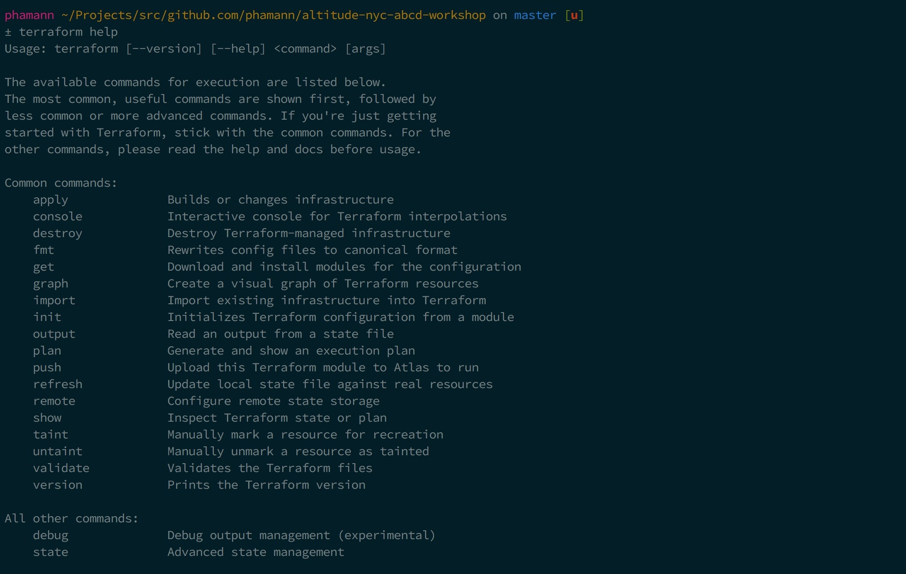
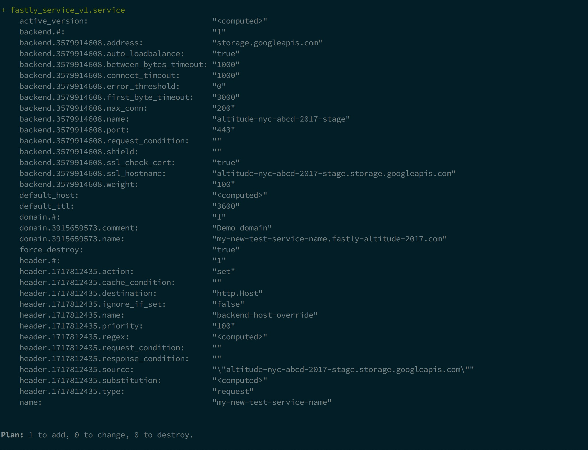

# 1. Define a Fastly service with Terraform

### 1.1 main.tf
Open the file `main.tf` within the `terraform` directory using your text editor of choice:

> _What's this?_
A Terraform file `.tf` houses your configurations. Configurations are written in HashiCorp Configuration Language (HCL), which is designed for human consumption so users can quickly interpret and understand their infrastructure configuration. Configuration can be in a single file or split across multiple files.

### 1.2 Variables and interpolation
We need to provide Terraform a Fastly API token so that it can authenticate with the API when creating our services and configuration. However, for security reasons we don't want to store our token in plain text within our source code. Therefore we will need to pass the value to Terraform via an environment variable.

You can define a [variable](https://www.terraform.io/docs/configuration/variables.html) in HCL using the syntax below. Add this variable to your `main.tf` file:
```hcl
variable "fastly_api_token" {
    type = "string"
}
```
> _What's this?_ 
Variables allow us to define the parameterization of Terraform configurations. They can have defaults, be provided with a variables file, asked for at execution, or overridden via the CLI. Values can be strings or maps and must be defined before used. Variables help make Terraform flexible, sharable, and extensible.

To then use the value of a variable later within your configuration file you can use the [interpolation syntax](https://www.terraform.io/docs/configuration/interpolation.html). Variable values can be interpolated using the `${var.<name>}` syntax. Such as:
```hcl
    api_key = "${var.fastly_api_token}"
```
When Terraform compiles your configuration the variable will be replaced with the actual value of your api token. This allows us to abstract environment specific state away from the declaration. 

### 1.3 Fastly provider
In the same Terraform file `main.tf` create a [Fastly provider](https://www.terraform.io/docs/providers/fastly/index.html) definition. We will set the value of the required `api_key` property to be the `fastly_api_token` variable we defined previously using the interpolation syntax. Later we will see how can pass [api token](https://docs.fastly.com/api/auth#tokens) provided to you at the beginning of the workshop as an environment variable via the CLI.

```hcl
variable "fastly_api_token" {
    type = "string"
}

provider "fastly" {
  api_key = "${var.fastly_api_token}"
}
```

> _What's this?_ 
A [provider](https://www.terraform.io/docs/configuration/providers.html) is an abstraction of the API/service provider such as GCP or Fastly. Providers typically require some sort of configuration data such as an API key or credential file.


### 1.4 Fastly resource
Define a new Fastly service [resource](https://www.terraform.io/docs/configuration/resources.html) block and set the backend to point to the GCS bucket which contains our demo website.
```hcl
resource "fastly_service_v1" "service" {
  name = "<YOUR NEW SERVICE NAME>"
  force_destroy = true
}
```
Make sure to use a unique and memorable name for your service to ensure it doesn't collide with anyone else in the workshop.

In the same resource block configure your default domain to be used on your service
```hcl
  # Ficitious domain name
  domain {
    name    = "<SERVICE NAME>.fastly-altitude-2017.com"
    comment = "Demo domain"
  }
```
> _Note:_
For the purpose of the workshop we've used a fake domain name `fastly-altitude-2017.com` as the Fastly API requires you to supply a domain when creating a service.

Then define your origin backend; for the purpose of the demo are going to connect to a pre-existing GCS bucket `altitude-nyc-abcd-2017-stage` which hosts the files for our demo website. However if you were defining a real service, this should point to your origins hostname.

```hcl
  # GCS backend containing our website files
  backend {
    address               = "storage.googleapis.com"
    ssl_hostname          = "altitude-nyc-abcd-2017-stage.storage.googleapis.com"
    name                  = "altitude-nyc-abcd-2017-stage"
    port                  = 443
    first_byte_timeout    = 3000
    max_conn              = 200
    between_bytes_timeout = 1000
  }
```
> _Note:_
As you can see, we are able to define all of the additional properties for a backend such as `max_conn` and `port`, a list of all possible options can be found on the [resource documentation](https://www.terraform.io/docs/providers/fastly/r/service_v1.html).

Finally, our backend requires a header [override condition](https://docs.fastly.com/guides/basic-configuration/specifying-an-override-host). Just as you can do via the Fastly web UI, we can define the condition as a block within our resource declaration.
```hcl
  # Header override condition to 
  header {
    name        = "backend-host-override"
    action      = "set"
    type        = "request"
    destination = "http.Host"
    source      = "\"altitude-nyc-abcd-2017-stage.storage.googleapis.com\""
  }
}
```

Your `main.tf` should now look something like this: 
```hcl
variable "fastly_api_token" {
    type = "string"
}

provider "fastly" {
  api_key = "${var.fastly_api_token}"
}

resource "fastly_service_v1" "service" {
  name = "my-altitude-service"

  force_destroy = true

  domain {
    name    = "my-altitude-service.fastly-altitude-2017.com"
    comment = "Demo domain"
  }

  backend {
    address               = "storage.googleapis.com"
    ssl_hostname          = "altitude-nyc-abcd-2017-stage.storage.googleapis.com"
    name                  = "altitude-nyc-abcd-2017-stage"
    port                  = 443
    first_byte_timeout    = 3000
    max_conn              = 200
    between_bytes_timeout = 1000
  }

  header {
    name        = "backend-host-override"
    action      = "set"
    type        = "request"
    destination = "http.Host"
    source      = "\"altitude-nyc-abcd-2017-stage.storage.googleapis.com\""
  }
}
```

### 1.5 Terraform CLI
Terraform is a local tool (runs on the current machine rather than the cloud) and all interactions with Terraform occur via the CLI. Using the command `terraform`, this binary should have been installed at the install stage of the workshop.

Run `terraform help` to generate the full list of Terraform commands.
```sh
$ terraform help
```

For the purpose of the workshop we will be focusing on the commands `plan` and `apply` to create our Fastly service.



### 1.6 Terraform plan
Now that we've defined our service configuration in our `terraforn/main.tf` file we want to observe what will happen if we were to deploy and apply these changes to our Fastly account. We can do this by running the [`terraform plan`](https://www.terraform.io/docs/commands/plan.html) CLI command:
```sh
$ terraform plan -var='fastly_api_token=<YOUR_TOKEN>' ./terraform
```
> _What's this?_ 
The plan shows you what will happen. You can save plans to guarantee what will happen
Plans show reasons for certain actions (such as re-create). Prior to Terraform, users had to blindly guess change ordering, parallelization, and rollout effect.

If you see an error when you first run the command, its most likely a syntax error, fix those then try again. Eventually you should see the change graph output in your terminal. 



### 1.7 Terraform apply
We should now have confidence after viewing our plan that Terraform is going to create our new Fastly service with the desired configuration. Therefore, all that is left is to apply our changes to Fastly in production. As with `plan`, we can run [`terraform apply`](https://www.terraform.io/docs/commands/apply.html) on our `main.tf` created in the last section. **This will create real resources in Fastly.**

```sh
$ terraform apply -var='fastly_api_token=<YOUR_TOKEN>' ./terraform
```
> _What's this?_ 
Updates existing resources when updates are allowed otherwise re-creates existing resources when updates are not allowed. Changes are executed in order based on the resource graph and parallelizes changes when possible. Handles and recovers transient errors.

You will be able to watch the resources being created in real-time in our terminal. If successful you should see an output such as:

```sh
Apply complete! Resources: 1 added, 0 changed, 0 destroyed.
```

#### 1.7.2 A note about state
You may have noticed Terraform created a `terraform.tfstate` file when running `apply`. This is where Terraform persists the state of the last-known arguments and attributes for all resources in our configuration. These contents known as "state" can be stored locally as a JSON file (local state) or stored in a remote shared location such as a GCS bucket (remote state). 

Whilst out of scope of this workshop, state is a very powerful feature of Terraform that allows configuration to easily be shared across machines, team members and continuous integration and deployment environment. 

### 1.8 Celebrate! 🎉
If your configuration was successfully applied you should be able to `curl` your newly created service:
```sh 
$ curl -v http://<YOUR SERVICE DOMAIN>.global.prod.fastly.net/index.html

HTTP/1.1 200 OK
Cache-Control: public, max-age=3600
Content-Type: text/html
Content-Length: 11651
Connection: keep-alive
X-Served-By: cache-lcy1136-LCY
X-Cache: HIT
X-Cache-Hits: 1
```
If you don't believe this you can even login to the Fastly web interface and look at your configuration.


